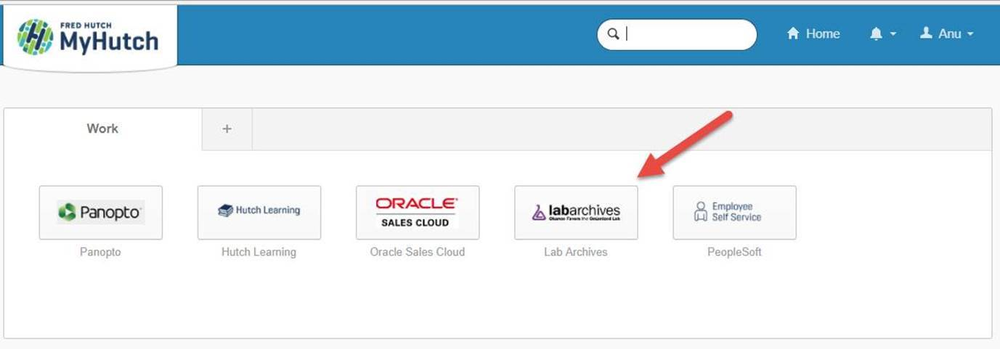

There are a number of software tools available that lend themselves well to the management of research labs and here we focus on those that have a free tier, are open source, or are supported by the Fred Hutch itself.  

## Reagent and Laboratory Organization
[Quartzy](http://www.quartzy.com) is a free, web-based lab management software. Users can organize lab member order requests, track order receipts, and organize lab inventory.  Quartzy's ordering system integrates with the Hutch Online Marketplace to streamline ordering and subsequent tracking of receiving in the lab, as well as lab storage and lot tracking. This software facilitates four main lab functions:

1. Submit supply requests -- Lab members can browse Quartzy's catalog of life science products and request supplies from their lab manager
2. Process supply requests -- Lab managers/Supply managers can receive and incoming supply requests for approval.
3. Receive and Organize lab supplies -- Users can mark supplies as received, automatically update inventory data, and alert lab members when supplies are back in stock and where to find them.
4. Search/Browse Lab inventory -- Users with appropriate permissions can search the entire contents of the lab for reagents, or browse individual locations within the lab database.

## Electronic Laboratory Notebooks
The Fred Hutch recently began supporting the use of an Electronic Laboratory Notebook (ELN) provide LabArchives.  Please follow the below steps to create and access your Fred Hutch supported LabArchives ELN account.

### Account Creation
[Click here](https://mynotebook.labarchives.com/signup) to create an ELN account with LabArchives. In this link, you will be asked to provide your name and email details along with a password (if you have already created your account or received a shared notebook from your colleagues, please proceed to next steps).

Once this account is created, you will receive a welcome email from LabArchives(which authenticates your email is valid) that will give you the link to access your account. Since we have integrated LabArchives ELN with our [MyHutch](https://fredhutch.okta.com/), the first time you click on the link in this email, it will redirect you to our [MyHutch](https://fredhutch.okta.com/) login page.

 

### MyHutch Integration
Once you login with your MyHutch credentials, there will be a link to the LabArchives ELN account on your home page.

Once you click on this button, it will prompt you though few screens to associate your MyHutch account with the LabArchives account. Once this association is complete (one time action), you will be able to access your ELN account from your MyHutch account seamlessly.

### Account access and training
Once you can access your account, you will be able to create notebooks, invite new users and collaborate with them. Please refer to the below training material to get started on using your ELN account.

- [Basic setup and know-how](https://youtu.be/8b0e5wZGN-g)
- [Additional training](https://youtu.be/Y4OqjCOj8vg)
- [The CenterNet ELN  page](https://centernet.fredhutch.org/cn/u/center-it/projects/eln-project.html) has an overview and training videos and link to LabArchives video material.

Contact the associated Fred Hutch Product Manager for LabArchives (Anu Pulletikurti) for any additional questions or concerns in creating and accessing your ELN accounts or getting started using it.

## Project Management
[Asana](http://www.asana.com) is a web-based project management software.  It allows groups to create tasks and assign those tasks to group members. Groups can get task reminders, define timelines, comment on the status of tasks, and easily edit the scope of tasks as projects develop.  Tasks may be independent, or dependent on the status of other tasks--for example, when laying out a project where Task A must be finished before Task B can be performed, you can define Task B to be dependent on the completion of Task A. This functionality allows easy design of task workflows within projects. Asana can be accessed on mobile devices, laptops, desktops, and tablets, which allows easy group communication, regardless of platform.

[Trello](http://www.trello.com) is another web-based project management software. Its functionality is very similar to Asana--groups can create and assign tasks, manage priorities and status, comment and attach files, and can be accessed on multiple device types.

## Team Communication and Collaboration
[Slack](http://www.slack.com) is a collaborative team messaging software. Communication in Slack happens in channels--which can be organized by project, topic, team, or whatever makes sense for a group. Conversations in Slack are searchable, which can facilitate group communication and easy onboarding of new group members. Slack also offers integration of other software tools (Google Drive, GitHub, Asana, Trello, etc.), which can be very useful for communicating project information. Several groups at Fred Hutch use Slack to communicate with members--including the Fred Hutch Bioinformatics Interest Group (FHBIG).  Individual groups or labs can create a private Slack workspace just for their group, or individuals can join other Slack workspaces as well as guests or members, depending on how the workspaces are set up by their administrators.  

## Available Resources
  - At [FHBIG's Slack Channel](https://fhbig.slack.com/), you can see an example of how groups are using Slack to facilitate communication between bioinformatics-oriented researchers here at Fred Hutch.
